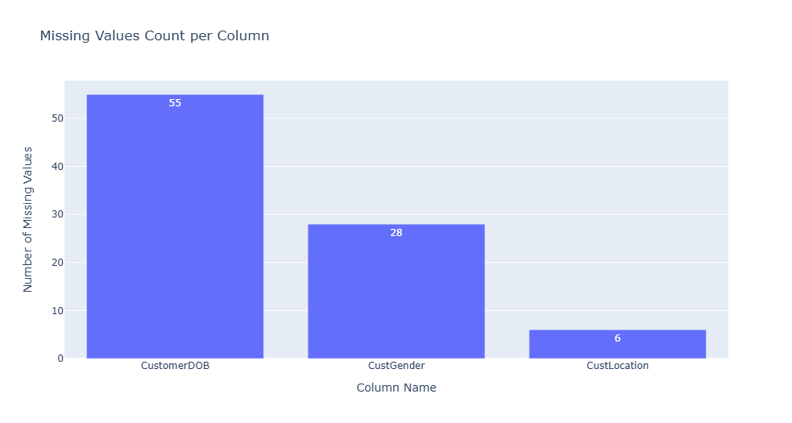
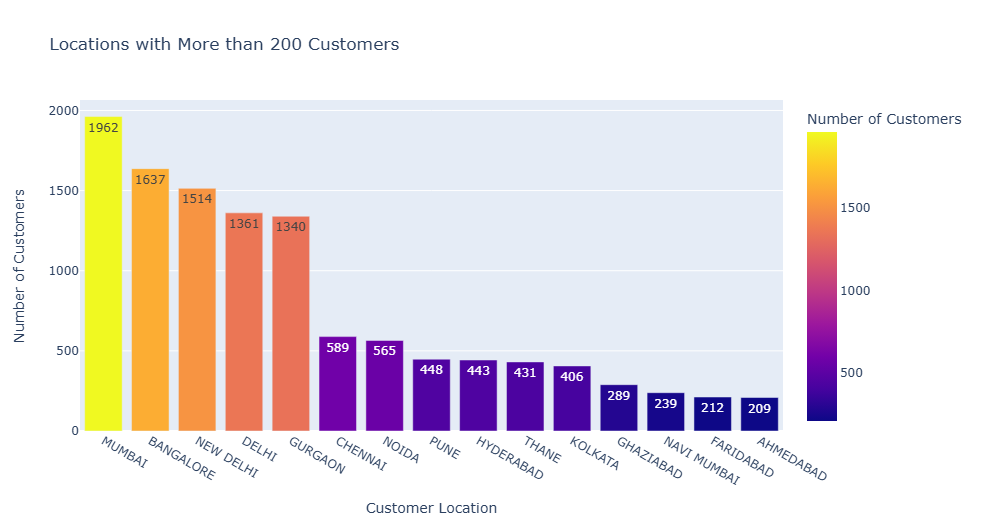
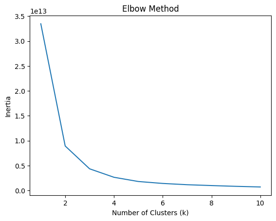
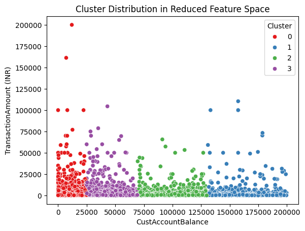

# Bank Customer Segmentation

This project focuses on segmenting bank customers to identify distinct groups based on their characteristics and behavior. The goal is to enable the bank to tailor marketing strategies, products, and services more effectively to each customer group.

## Project Overview

Customer segmentation helps businesses, like banks, identify patterns in customer behavior, allowing for more personalized and targeted services. In this project, we use clustering techniques to segment customers and improve business decision-making.

### Objectives:
- Segment bank customers into distinct groups.
- Provide insights into the characteristics of each group.
- Use clustering techniques to drive marketing and business strategies.

## Dataset
- The dataset has 20,000 entries and contains various customer attributes, such as Account balance, Transaction amount and gender

## Methodology

### 1. Data Understanding
- **Format**: `TransactionDate` and `TransactionTime` data types are not in the appropriate format (datetime).
- **Gender**: 14,707 males and 5,265 females.
- **Missing values**: Only 3 columns have missing values as shown below:

- **Locations**: Number of unique locations in the data are 1,869. With Mumbai leading with the most customers as shown in the plot below.

- Minimum and maximum account balances in the data are;
    - min    0.00
    - max    199962.75
 This indicates that the data may not fully capture all the customers and maybe a subset of them.

### 2. Data Preprocessing

#### Handling missing values and data types
- Below are the steps taken in preprocessing the data for modelling
    1. Drop rows where there are null values in the `CustGender`, `CustomerDOB`.
    2. Fill missing values in `CustLocation` and `CustomerDOB` by backfilling (using the next row's value).
    3. The null values for `CustAccountBalance` will be replaced with the median value.
    4. Convert the `TransactionDate` to date format. From this *August* is observed to have the most transactions followed by *September*. This could be because around that time a lot of indians travel abroad.
    5. Drop the `TransactionTime` column since the time format is not specified, pandas cannot infer for conversion. The age of the customer is therefore not possible to obtain from the data.

#### Standardizing the data

- Use StandardScaler from sklearn to standardize the data so that each feature has a mean of 0 and a standard deviation of 1. 

#### Encoding the data

-  Encode the `CustGender`, `CustLocation`, `Month` columns. As aresult there were 1878 features.
- Convert the column names to string to avoid errors with the kMeans clustering.
- Drop the `CustomerDOB`, `TransactionID` and `CustomerID` since they are not needed in the model, leaving 1875 features.
- All numerical data is converted to int64 for kMeans clustering since it handles only one data type all through.

### 3. Clustering Model: K-means
- Use **K-means clustering** to segment customers.
- **Elbow Method** is applied to determine the optimal number of clusters by plotting the within-cluster sum of squares against the number of clusters. 4 were chosen based on the plot below

- Next the cluster sizes are checked. 
    - Cluster 2 is the largest, indicating that it might be the "dominant" cluster in terms of data density.
    - Cluster 1 is the smallest, suggesting it might represent outliers or less common patterns.

| Cluster | Count |
|---------|-------|
| 0       | 4072  |
| 1       | 909   |
| 2       | 13213 |
| 3       | 1723  |

- Use the Random Forest classifier to get the most important features;
    - `CustAccountBalance`
    - `TransactionAmount (INR)`

- Using only this two features slightly  changes the cluster sizes:

| Cluster | Count |
|---------|-------|
| 0       | 13164 |
| 1       | 4110  |
| 2       | 1733  |
| 3       | 910   |

- Cluster 0 is now the largest cluster.
- Cluster 1 is still the smallest, indicating it may represent an unusual or outlier group.

Representing the data in a scatter plot as shown below

**Insights:**

**`Cluster 0:`** Likely represents the "default" or most common customer profile.

**`Cluster 1:`** May represent outliers, customers with unusual account balances or transaction amounts.

**`Cluster 2`, `Cluster 3`:** Might represent distinct customer segments with specific behaviors.

# Conclusion:

The clustering analysis of customer data based on two features; `CustAccountBalance` and `TransactionAmount (INR)` has yielded four distinct clusters. These clusters provide insights into customer segments based on their account balances and transaction behaviors.

- **Cluster 0**, the largest group, represents the most common customer pattern in terms of account balance and transaction amounts.
- **Cluster 1**, the smallest group, might represent outliers or customers with unique behaviors.
- **Clusters 2 and 3** show distinct patterns, possibly indicating customer groups with different spending or account balance behaviors.

The analysis provides an initial understanding of how customer behavior can be segmented based on these two features. This segmentation can serve as a basis for further targeted marketing, customer service strategies, or product offerings.

# Recommendations:

1. **Customer Segmentation for Targeted Strategies**:
   - Use the identified clusters to tailor marketing strategies, products, or customer services. For example, Cluster 0 could represent standard customers who require routine engagement, while Cluster 1 might represent high-value or at-risk customers requiring special attention.

2. **Feature Expansion**:
   - Consider adding more features to the clustering model for more granular segmentation.
   - Incorporating other customer attributes like correct Date of Birth format, reasons for transactions and also age can improve the clustering results and provide more useful insights.

3. **Reevaluate the Cluster Sizes**:
   - The imbalance in cluster sizes (with Cluster 0 being much larger) suggests that some clusters may represent more typical customers, while others may represent niche behaviors. Investigating these clusters in detail can uncover patterns that may have business implications, such as identifying high-value customers or predicting churn.

4. **Monitor Cluster Stability**:
   - Monitor the clusters over time to ensure that they remain stable as customer behavior changes. Consider periodic re-clustering to adapt to shifts in the market or customer activity.

5. **Advanced Clustering Techniques**:
   - Consider experimenting with more advanced clustering techniques that are more costly such as hierarchical clustering or Gaussian Mixture Models (GMM) for better fitting or more interpretable clusters.

