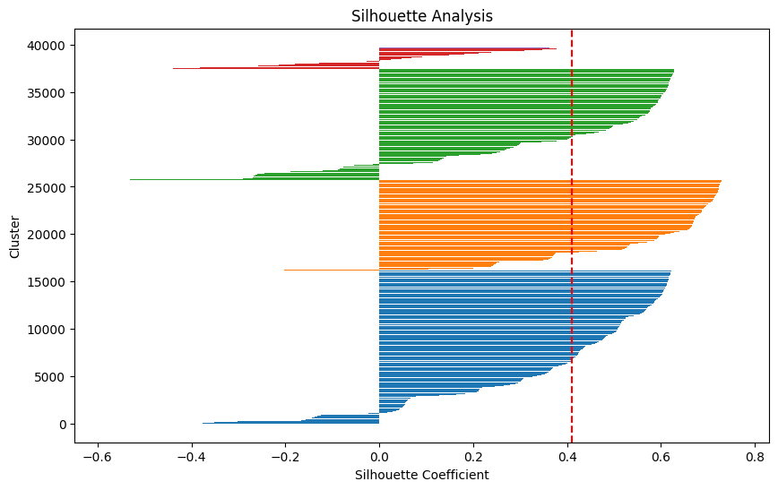

# Bank Customer Segmentation

This project focuses on segmenting bank customers to identify distinct groups based on their characteristics and behavior. The goal is to enable the bank to tailor marketing strategies, products, and services more effectively to each customer group.

## Project Overview

Customer segmentation helps businesses, like banks, identify patterns in customer behavior, allowing for more personalized and targeted services. In this project, we use clustering techniques to segment customers and improve business decision-making.

### Objectives:
- Segment bank customers into distinct groups.
- Provide insights into the characteristics of each group.
- Use clustering techniques to drive marketing and business strategies.

## Dataset

The dataset contains various customer attributes, such as:
- **Demographics**: Age and gender
- **Behavioral Data**: Account usage such as transaction patters.

## Methodology

### 1. Data Preprocessing
- Cleaning missing values.
- Encoding categorical variables.
- Normalizing or scaling numerical features for clustering.

### 2. Feature Engineering
To enhance the dataset and improve the model's performance, the following features were engineered:

1. **Age**  
   - **Description**: Age of the customer based on the current year.  
   - **Calculation**: Subtracted the customer's year of birth (from the dataset) from the current year to compute the age.  
   - **Purpose**: Helps understand the demographic distribution and behavior patterns across different age groups.

2. **Ave_Transaction**  
   - **Description**: Average transaction amount for each customer.  
   - **Calculation**: Aggregated the transaction amounts by `CustomerID` and divided by the total number of transactions for that customer.  
   - **Purpose**: Identifies the spending behavior of customers, providing insights into high-value and low-value customers.

3. **Transaction_frequency**  
   - **Description**: Total number of transactions made by each customer.  
   - **Calculation**: Grouped transactions by `CustomerID` and calculated the count of transactions per customer.  
   - **Purpose**: Highlights customer engagement levels and frequency of interactions with the business.

### 3. Clustering Model: K-means
- Used **K-means clustering** to segment customers.
- **Elbow Method**: Applied to determine the optimal number of clusters by plotting the within-cluster sum of squares against the number of clusters. 6 were chosen based on the plot.
- Next the clusters were profiled. This involves analyzing the average value of features in each cluster to understand the key characteristics of each customer group. Below were the insights

**Insights**

- **Cluster Separation:**
Clusters 0, 1, and 2 appear to be relatively close to each other in the PCA space, suggesting some degree of similarity among these customer segments.
- **Outlier Clusters:**
Cluster 4 and Cluster 5 seem to be more distinct and separated from the other clusters, potentially indicating unique customer behaviors or characteristics.
- **Cluster Density:**
The density of points within each cluster can provide insights into the homogeneity or heterogeneity of the customer segments. For instance, if a cluster has a high density of points, it suggests that the customers within that segment are relatively similar to each other.

Below is the visualization of the silhouette analysis for the clustering results:

**Clusters with Wide Silhouette Bars**
- The clusters with wider bars (more data points) contribute significantly to the overall clustering structure.

- Some data points (red bars and parts of other clusters) have negative silhouette values, indicating that they might be misclassified or better suited to another cluster.

- The average silhouette score (0.41) indicates that most points are reasonably well-clustered, though there is room for improvement.

## Results

The K-means algorithm provided clusters of customers, each with unique characteristics. By analyzing these segments, the bank can tailor its marketing efforts and product offerings more effectively.

### Cluster Profiles:
- Profile of each cluster with key customer characteristics.
- Insights into customer behavior within each segment.

## Next Steps

- Refine the clustering model by cleaning the data further.
- Validate the segments against business objectives and customer data.
- Finally, deploy the segmentation model for operational use by the bank.

### Requirements

- Libraries: `pandas`, `numpy`, `matplotlib`, `scikit-learn`, `seaborn`

---

